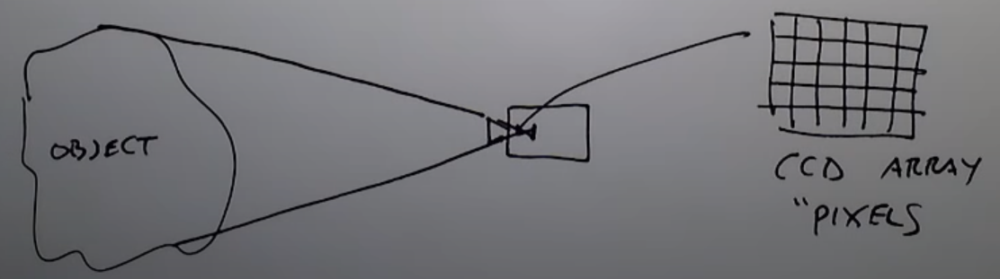

This series of demos, are an excersise from the Rich Radke Youtube channel
Source:

  https://www.youtube.com/watch?v=UhDlL-tLT2U&list=PLuh62Q4Sv7BUf60vkjePfcOQc8sHxmnDX
  
  
  
## Lecture 1. Introduction

What is a digital Image?

